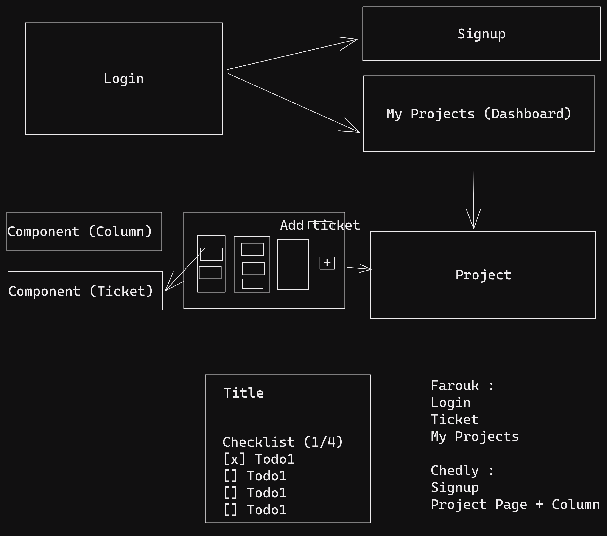

# ProjectPlanner

A Project Planner Web application using Blazor Server and Entity Framework Core.

## Todo

-   Persistence :

    -   [x] EF Core setup and connection to SQL Server
    -   [x] Initial Migration

-   Authentication :

    -   [ ] Identity setup
    -   [ ] Login Page customization
    -   [ ] Sign up Page customization

-   UI :

    -   [ ] Project Card Component
    -   [ ] Ticket Component
    -   [ ] Column Component
    -   [ ] My Projects Page
    -   [ ] Project Page
    -   [ ] Add column creation form
    -   [ ] Add ticket creation form
    -   [ ] Add tag creation form

-   General :
    -   [ ] Log actions of each project to a file
    -   [ ] Ticket filtering
    -   [ ] Add ability to remove columns and tickets

## Workflow

